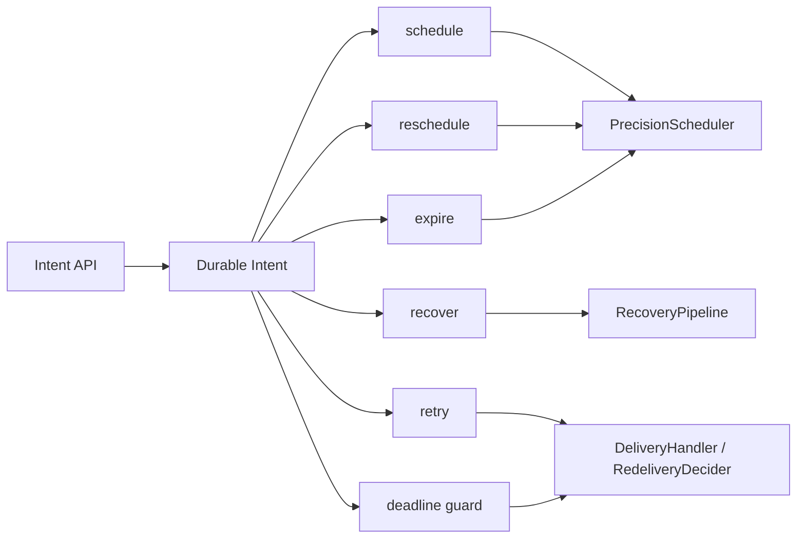
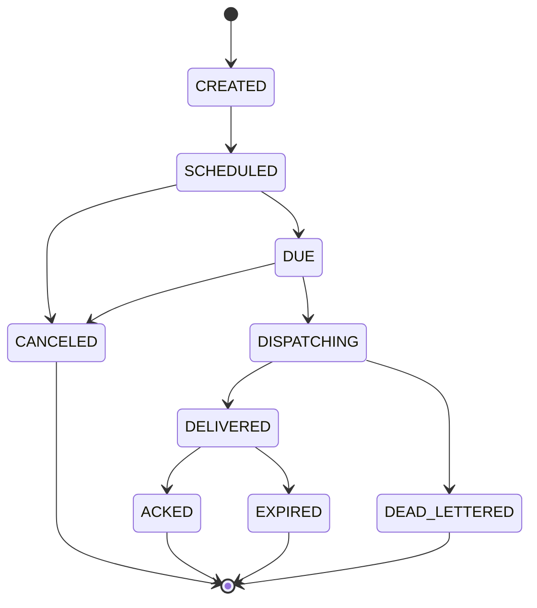

# LoomQ Core Model

LoomQ is a durable time kernel for distributed systems.

It focuses on one thing: making future events happen reliably, with persistence, recovery, retry orchestration, and deadline handling built in.

## Glossary

| Term | Meaning in LoomQ |
|------|------------------|
| `Intent` | The durable scheduling record. This is the public model used by the API and the engine. |
| `Task` | A legacy/public-facing synonym in older docs. Prefer `Intent` for new material. |
| `Job` | A single execution attempt or delivery action derived from an `Intent`. |
| `Deadline` | The latest acceptable completion time for an `Intent`. |
| `Schedule` | The initial placement of an `Intent` into the time kernel. |
| `Reschedule` | Updating the execution time of an existing `Intent`. |
| `Expire` | Transitioning an `Intent` past its allowed time window. |
| `Recover` | Rebuilding pending work after restart from WAL/snapshot state. |
| `Retry` | Re-queuing an `Intent` after a failed delivery attempt. |

## Model Shape

## State Machine

The current code defines the lifecycle in [`IntentStatus`](../../loomq-core/src/main/java/com/loomq/domain/intent/IntentStatus.java).

## Correctness Boundaries

LoomQ core is responsible for:

- durable scheduling
- rescheduling
- expiration handling
- recovery after restart
- retry orchestration
- time-driven execution hooks

LoomQ core is not responsible for:

- lock semantics
- lease ownership rules
- fencing token policy
- leader election
- business-specific reservation rules

Those belong to a future shell such as `loomqex`, which should build on the kernel instead of being embedded into it.

## Public Hooks

The codebase already exposes shell-oriented extension points:

- `CallbackHandler`
- `DeliveryHandler`
- `RedeliveryDecider`

That means the kernel can stay focused while higher-level products define their own behavior on top.

