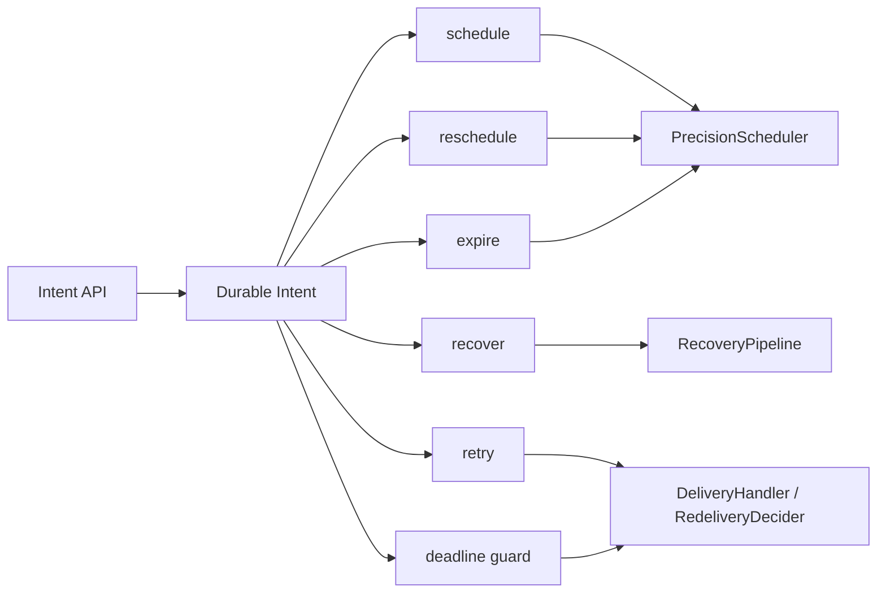
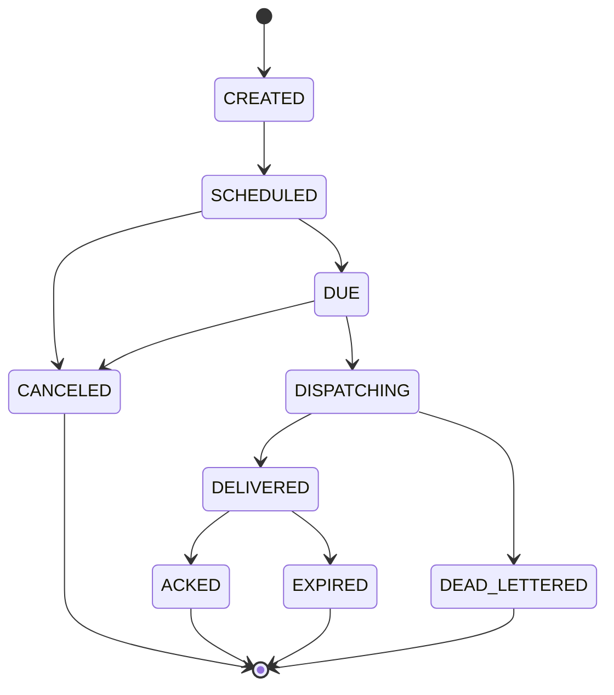

# LoomQ Core Model

LoomQ is a durable time kernel for distributed systems.

It focuses on one thing: making future events happen reliably, with persistence, recovery, retry orchestration, and deadline handling built in.

## Glossary

| Term | Meaning in LoomQ |
|------|------------------|
| `Intent` | The durable scheduling record. This is the public model used by the API and the engine. |
| `Legacy term` | A legacy/public-facing synonym in older docs. Prefer `Intent` for new material. |
| `Job` | A single execution attempt or delivery action derived from an `Intent`. |
| `Deadline` | The latest acceptable completion time for an `Intent`. |
| `Schedule` | The initial placement of an `Intent` into the time kernel. |
| `Reschedule` | Updating the execution time of an existing `Intent`. |
| `Expire` | Transitioning an `Intent` past its allowed time window. |
| `Recover` | Rebuilding pending work after restart from WAL/snapshot state. |
| `Retry` | Re-queuing an `Intent` after a failed delivery attempt. |

## Model Shape



## State Machine



The current code defines the lifecycle in [`IntentStatus`](../../loomq-core/src/main/java/com/loomq/domain/intent/IntentStatus.java).

## Correctness Boundaries

LoomQ core is responsible for:

- durable scheduling
- rescheduling
- expiration handling
- recovery after restart
- retry orchestration
- time-driven execution hooks

LoomQ core is not responsible for:

- lock semantics
- lease ownership rules
- fencing token policy
- leader election
- business-specific reservation rules

Those belong to a future shell such as `loomqex`, which should build on the kernel instead of being embedded into it.

## Durability Semantics

LoomQ 的持久性保证取决于创建 Intent 时选择的 `AckMode`。理解这个区别对于正确使用 LoomQ 至关重要。

### AckMode 对照表

| AckMode | WAL 写入 | API 返回时机 | 崩溃窗口 | 适用场景 |
|:--------|:---------|:------------|:---------|:---------|
| `ASYNC` | mmap 写入，不等 fsync | 写入内存后立即返回 | **有 — API 返回成功不等于数据已持久化，进程崩溃后 Intent 可能丢失** | 低延迟、明确接受 at-most-once 语义 |
| `DURABLE`（默认） | fsync 后返回 | 等待 WAL fsync 完成 | 无 — WAL 已落盘 | 大多数业务场景 |
| `REPLICATED` | fsync + 副本确认 | 等待主节点 fsync + 副本 ack | 无 — 多副本保障 | 金融、交易等零丢失场景 |

### 崩溃窗口详解（ASYNC 模式）

`createIntent()` 在 `ASYNC` 模式下的执行流程：

```
1. intentStore.save(intent)        ← 内存写入
2. scheduler.schedule(intent)      ← 调度入队
3. return seq                      ← API 返回 201
4. walWriter.writeAsync(payload)   ← 异步 WAL 写入（后台）
   ↕ 崩溃窗口：如果进程在此期间退出，Intent 丢失
5. WAL mmap flush                  ← 数据落盘
```

步骤 3 到步骤 5 之间存在**崩溃窗口**：API 已返回成功，但数据尚未持久化。如果进程在此窗口内崩溃，重启后该 Intent 不会被恢复。

**这不是 bug，而是设计选择**：`ASYNC` 模式优先吞吐（<1ms 延迟），接受极小概率的数据丢失。

### 对比：状态变更操作的持久性

与 `createIntent` 不同，**状态变更操作始终使用 `DURABLE` 模式**：

| 操作 | WAL 模式 | 说明 |
|:-----|:---------|:-----|
| `createIntent` | 由 `ackLevel` 参数决定 | 可选 ASYNC/DURABLE/REPLICATED |
| `updateIntent` | 始终 DURABLE | 硬编码 `AckMode.DURABLE` |
| `cancelIntent` | 始终 DURABLE | 硬编码 `AckMode.DURABLE` |
| `fireNow` | 始终 DURABLE | 硬编码 `AckMode.DURABLE` |

这意味着：即使 Intent 以 `ASYNC` 模式创建，后续的取消、更新、立即触发等操作都保证 WAL 落盘后才返回。

### 选择建议

```
                        ┌─────────────────────┐
                        │  需要零丢失保证？    │
                        └──────────┬──────────┘
                                   │
                    ┌──────────────┴──────────────┐
                    ▼                              ▼
                  是                              否
                    │                              │
        ┌───────────┴───────────┐      ┌──────────┴──────────┐
        │  需要多节点容灾？     │      │  延迟敏感 (<1ms)？   │
        └───────────┬───────────┘      └──────────┬──────────┘
                    │                              │
          ┌─────────┴─────────┐          ┌────────┴────────┐
          ▼                   ▼          ▼                 ▼
        是                  否         是                否
          │                   │          │                 │
     REPLICATED           DURABLE      ASYNC           DURABLE
```

> **注意**：`REPLICATED` 模式需要 Raft 集群支持。单节点部署下，`REPLICATED` 等同于 `DURABLE`。

## Public Hooks

The codebase already exposes shell-oriented extension points:

- `CallbackHandler`
- `DeliveryHandler`
- `RedeliveryDecider`

That means the kernel can stay focused while higher-level products define their own behavior on top.
