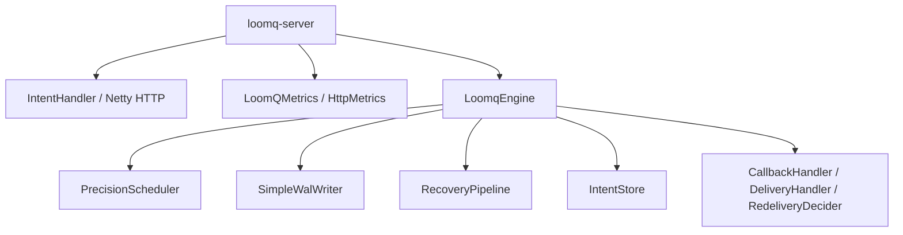
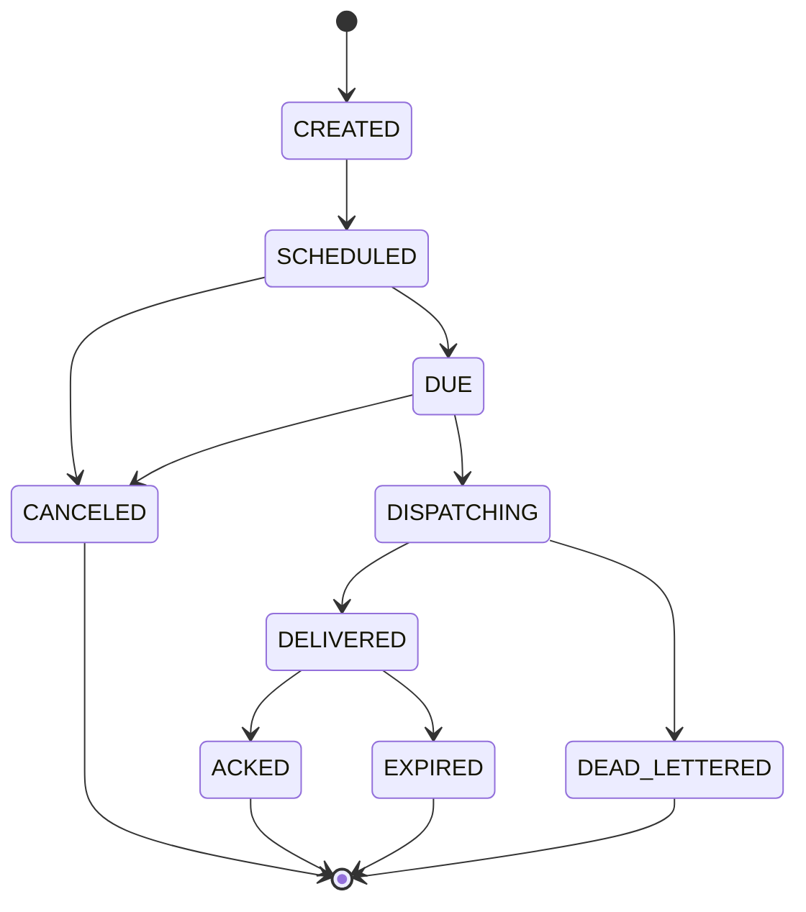

# LoomQ Architecture

This document describes the current codebase structure, not the historical task-oriented version.

## High-Level Layers

## Core Responsibilities

### `loomq-core`

- durable intent lifecycle
- scheduling and rescheduling
- WAL persistence
- recovery after restart
- delivery and retry hooks
- precision-tier metrics

### `loomq-server`

- HTTP transport
- request validation
- JSON serialization
- Netty routing and backpressure
- standalone runtime bootstrap

## Intent Lifecycle

The code currently uses the `Intent` model and the `IntentStatus` state machine.

## Extension Points

The kernel is intentionally shell-friendly:

- `CallbackHandler` reports lifecycle events back to the host
- `DeliveryHandler` owns the actual delivery mechanism
- `RedeliveryDecider` decides whether to retry after failure

That boundary keeps LoomQ focused on time semantics and lets higher-level products define lock or lease behavior outside the core.

## Config Path

The standalone server loads `LoomqConfig`, prints a runtime summary, and passes the effective WAL config into `LoomqEngine`.

For the canonical key list, see [`../operations/CONFIGURATION.md`](../operations/CONFIGURATION.md).

