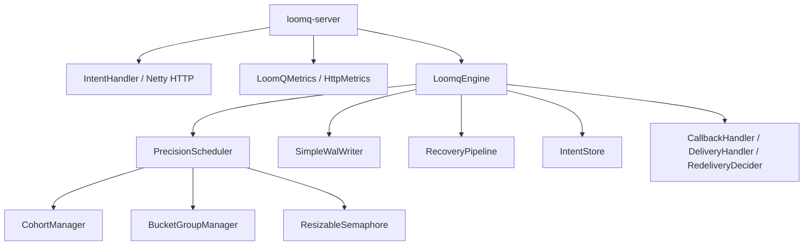
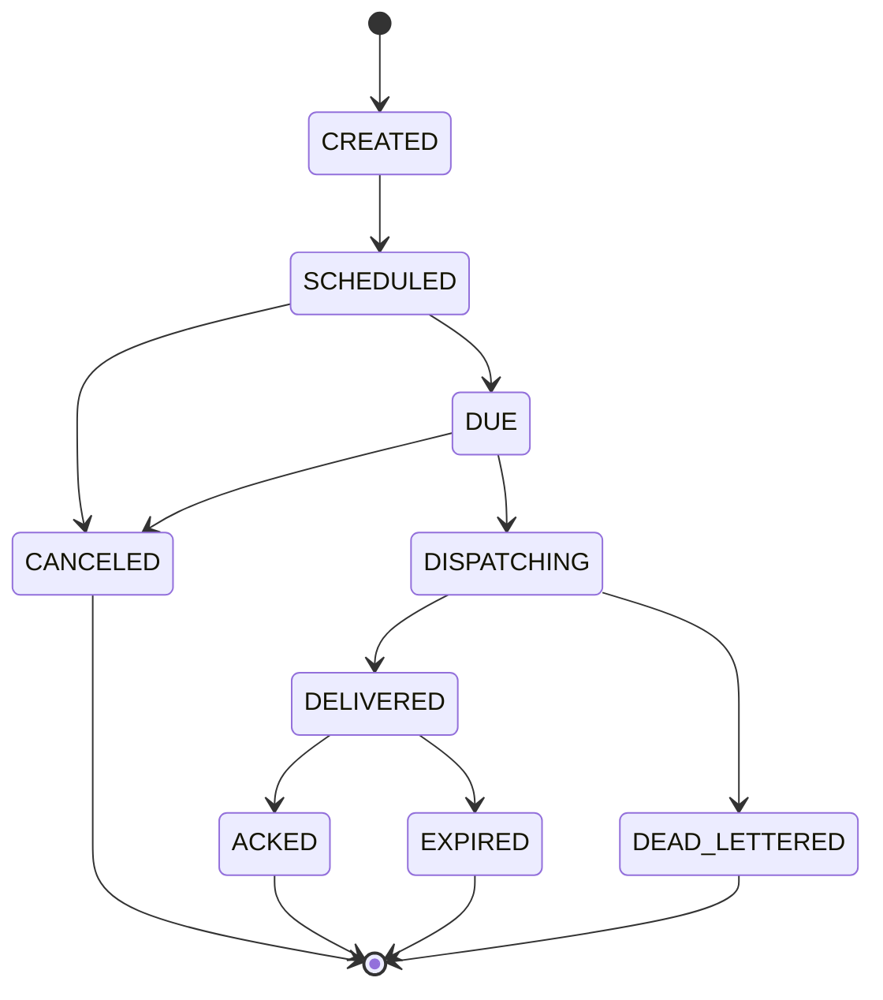

# LoomQ Architecture

This document describes the current codebase structure as of v0.8.0.

## High-Level Layers

## Module Responsibilities

### `loomq-core`

- durable intent lifecycle (Intent, IntentStatus, IntentStore)
- scheduling and rescheduling (PrecisionScheduler)
- WAL persistence (SimpleWalWriter, FFM API, CRC32)
- recovery after restart (RecoveryPipeline, SnapshotManager)
- delivery and retry hooks (DeliveryHandler, RedeliveryDecider)
- precision-tier metrics (MetricsCollector, per-tier histograms)
- cross-tier concurrency (ResizableSemaphore, Arrow borrowing, AdapTBF)

### `loomq-server`

- HTTP transport (NettyHttpServer, epoll, pooled allocator)
- request routing (RadixTree)
- JSON serialization (hand-written zero-copy)
- request validation and backpressure (semaphore-based)
- webhook delivery (HttpDeliveryHandler via Reactor Netty)
- standalone bootstrap (LoomqServerApplication)

## Scheduler Internals

### Scan-Dispatch Pipeline

1. **Scan**: Per-tier `ScheduledExecutorService` fires at tier's precision window interval
2. **BucketGroup.scanDue()**: Returns all intents whose executeAt has passed
3. **Enqueue**: Due intents are pushed to the tier's `ConcurrentLinkedDeque`
4. **Consume**: N virtual-thread batch consumers per tier poll the queue
5. **Acquire**: Consumer calls `acquireWithBorrow()` — own tier first, then borrow from lower tiers
6. **Deliver**: `deliveryHandler.deliverAsync(intent)` — fire-and-forget
7. **Release**: Permit released in async callback; borrowed permits decrement lender's `borrowedCount`

### Cohort Wakeup (CSA-Inspired)

For intents with `delayMs > precisionWindowMs`, per-intent virtual-thread sleep is replaced by cohort batching:

- Intents are grouped by `cohortKey = floor(executeAt / precisionWindowMs)`
- `CohortManager` maintains a `ConcurrentSkipListMap<cohortKey, List<Intent>>`
- A single daemon thread (`cohort-waker`) sleeps until the next cohort's due time
- On wake, all intents in that cohort are flushed to `BucketGroupManager`
- **One thread handles thousands of intents** — eliminates per-intent VT overhead

### Arrow Cross-Tier Borrowing

When a tier's own `ResizableSemaphore` is full:

1. Try `own.tryAcquire()` — fast path, no overhead
2. Iterate lower-priority tiers: `other.tryAcquire(100ms)`
3. On success: `other.incrementBorrowed()`, return borrowed semaphore
4. On exhaustion: `own.acquire()` (blocking fallback)
5. On release: if `acquired != ownTier`, call `acquired.decrementBorrowed()`

### AdapTBF Lending Constraints

To prevent high-priority tiers from starving low-priority tiers:

- `MAX_LEND_RATIO = 0.5`: each tier lends at most 50% of its slots
- `ResizableSemaphore.borrowedCount` tracks active lends
- Check before lending: `borrowedCount < maxSlots * 0.5`
- Implicit min-reserve: at least 50% of slots always available for the owning tier

## ResizableSemaphore

Extends `java.util.concurrent.Semaphore` for zero-overhead hot path:

- `acquire()`, `tryAcquire()`, `availablePermits()` — **inherited directly** (no delegation)
- `release()` — overridden with shrink check:
  - Fast path: `currentMax <= targetMax` → `super.release()`
  - Slow path (shrinking): CAS-decrement `currentMax`, discard excess permit
- `resize(newMax)` — `synchronized`: increase via `super.release(delta)`, decrease via target
- `resizeImmediate(newMax)` — `synchronized`: blocks until all excess permits drained
- AdapTBF: `getBorrowedCount()`, `incrementBorrowed()`, `decrementBorrowed()`

## Intent Lifecycle

The code uses the `Intent` model and `IntentStatus` state machine.

## Extension Points

The kernel is shell-friendly:

- `CallbackHandler` — reports lifecycle events back to the host
- `DeliveryHandler` — owns the actual delivery mechanism (HTTP, MQ, local)
- `RedeliveryDecider` — decides whether to retry after failure

This boundary keeps LoomQ focused on time semantics. Higher-level lock/lease behavior belongs outside the core.

## Config Path

The standalone server loads config, prints a runtime summary, and passes effective config into `LoomqEngine`.

For the canonical key list, see [Configuration Reference](../operations/CONFIGURATION.md).
