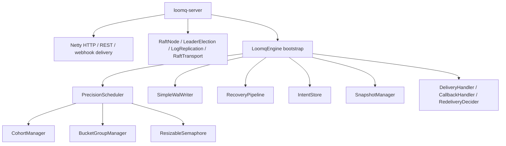

# LoomQ Architecture

This document describes the current codebase structure as of v0.9.2.

## High-Level Layers

## Module Responsibilities

### `loomq-core`

- durable intent lifecycle: `Intent`, `IntentStatus`, `IntentStore`
- scheduling and rescheduling: `PrecisionScheduler`
- cohort wakeup and batching: `CohortManager`, `BucketGroupManager`
- durable storage: `SimpleWalWriter`, `SnapshotManager`
- restart recovery: `RecoveryPipeline`, `WalReplayManager`
- pluggable state storage: `ConcurrentIntentStore`, `RocksDBIntentStore`
- delivery and retry hooks: `DeliveryHandler`, `RedeliveryDecider`, `CallbackHandler`
- precision-tier metrics: `MetricsCollector`, per-tier histograms
- cross-tier concurrency: `ResizableSemaphore`, Arrow borrowing, AdapTBF

### `loomq-server`

- HTTP transport and routing: Netty server, REST handlers, JSON serialization
- webhook delivery: `NettyHttpDeliveryHandler`, `HttpCallbackHandler`
- Raft consensus wiring: leader election, log replication, snapshot install
- Raft observability and safety: leader-authoritative reads, health/metrics surfacing, startup guardrails
- standalone bootstrap: `LoomqServerApplication`

## Runtime Flows

### Intent Creation and Scheduling

1. API layer validates the request and builds an `Intent`
2. `LoomqEngine` persists the intent through the WAL and current `IntentStore`
3. `PrecisionScheduler` places the intent into the correct tier bucket or cohort
4. When the execution time arrives, the scheduler moves the intent to the delivery queue
5. Delivery happens through the configured `DeliveryHandler`

### Raft Replication Path

1. A leader is elected through `LeaderElection`
2. Log entries are appended in `RaftLog` and written through the WAL layer
3. `LogReplication` drives `AppendEntries` to peers and tracks progress
4. Followers apply committed entries to the current store state
5. If a follower is too far behind, the leader sends `InstallSnapshot`
6. Stale responses are ignored via generation checks during step-down and leadership change

### Raft Read Path

1. In Raft mode, `GET /v1/intents/{intentId}` is leader-authoritative
2. Followers reject reads with a retryable 503 and leader hint when known
3. The leader only serves reads while its quorum freshness lease is valid, which prevents stale reads after it has lost contact with a majority
4. `/health` and `/metrics` expose role, leader id, term, commit index, commit lag, replication lag, peer reachability, and whether the leader is currently accepting reads / writes so operators can tell whether reads are safe

### Recovery and Snapshot Path

1. On startup, `RecoveryPipeline` clears transient state and rebuilds the store
2. `SnapshotManager` restores the latest snapshot first
3. WAL replay rehydrates the remaining entries
4. `RaftLog` and WAL metadata are restored together so the snapshot boundary stays consistent
5. Late-joining followers can catch up from the snapshot boundary instead of scanning the full log

## Extension Points

The kernel is designed to stay shell-friendly:

- `DeliveryHandler` - owns the actual delivery mechanism
- `CallbackHandler` - reports lifecycle events back to the host
- `RedeliveryDecider` - decides whether to retry after failure
- `IntentStore` - chooses between in-memory and durable local storage
- Raft wiring stays in `loomq-server` so the embedded kernel remains reusable

## Configuration Path

The standalone server loads configuration, prints a runtime summary, validates Raft topology and port constraints up front, and passes the effective settings into `LoomqEngine` and the Raft components.

For the canonical key list, see [Configuration Reference](../operations/CONFIGURATION.md).
